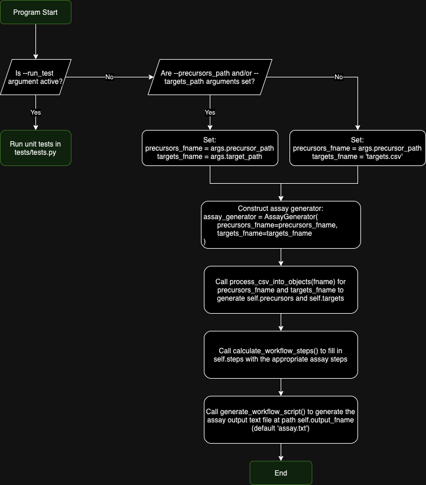
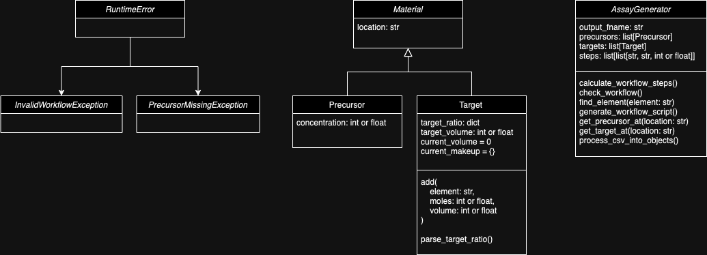

<!-- 
    README.md
    Written by @geveke.tom
    Febuary 2024
-->

## FL96 Script 

### Theory

For each target, calculate the volume to create 1 Mole given the precursor's concentrations.

$$V_{1\:mole} = \Sigma^{n}_{i=0}(\frac {ratio_i} {concentration_{i, \:[mol\: /\: L]}})$$

Then, scale the volumes needed by s:
$$ 
s = \frac{V_{target}}{V_{1\:mole}}  
$$

Thus, the total volume needed for each precursor can be written as:

$$ 
Volume_{precursor \: i} = \frac{V_{target}}{\Sigma^{n}_{i=0}(\frac {ratio_i} {concentration_{i, \:[mol\: /\: L]}})} \times \frac {ratio_i} {concentration_{i, \:[mol\: /\: L]}}
$$

### Flowchart


### Class Diagram


### Installation
Note: No additional dependencies are required, other than Python 3, which can be installed at [python.org](https://www.python.org/downloads/).
1. Clone git repository: 
    ```
    git clone https://github.com/tgeveke/FL96-Interview
    ```
2. Change into code directory
    ```
    cd FL96-Interview
    ```

### Usage
1. Run code using:
    ```
    python3 FL96.py
    ```
    or to execute unit tests in tests/tests.py:
    ```
    python3 FL96.py --run_tests
    ```
    or to specify specific paths to other precursor and/or target CSVs:
    ```
    python3 FL96.py --precursors_path "path/to/csv.csv" --targets_path "path/to/csv.csv"
    ```
